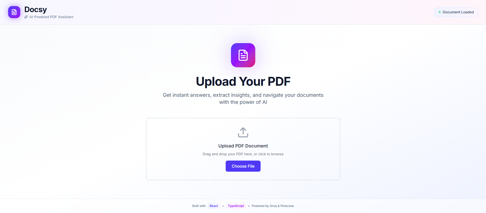

# Docsy — Chat with Your PDFs

A full-stack AI-powered application that lets you upload PDFs and chat with them using natural language. Get instant answers with page citations directly from your documents.



---

## Features

- **AI-Powered Chat** — Ask questions and get contextual answers from your PDFs
- **Smart Citations** — Click page numbers to jump to relevant sections
- **Built-in PDF Viewer** — Zoom, scroll, and navigate seamlessly
- **Modern UI** — Clean design with glassmorphism and smooth animations
- **Fully Responsive** — Works on desktop, tablet, and mobile

---

## Tech Stack

### Frontend

- **React 18** + **TypeScript**
- **Vite** (build tool)
- **Tailwind CSS** (styling)
- **react-pdf** (PDF rendering)
- **Axios** (API client)
- **Lucide React** (icons)

### Backend

- **Node.js** + **Express**
- **MongoDB** (document metadata)
- **Cloudinary** (PDF storage)
- **Pinecone** (vector database)
- **HuggingFace** (text embeddings)
- **Groq** (AI chat responses)

---

## Project Structure

```
src/
├── components/          # UI components (Chat, PDFViewer, FileUpload, etc.)
├── context/             # Global state management
├── services/            # API integration (api.ts)
├── types/               # TypeScript definitions
├── App.tsx              # Root component
└── main.tsx             # Entry point
```

---

## Getting Started

### Prerequisites

- Node.js 18+
- npm or yarn
- Backend API running (see backend setup)

### Installation

1. **Clone the repository**

   ```bash
   git clone <your-repo-url>
   cd docsy-frontend
   ```

2. **Install dependencies**

   ```bash
   npm install
   ```

3. **Configure environment variables**

   Create a `.env` file:

   ```env
   VITE_API_URL=http://localhost:5000
   ```

4. **Start development server**

   ```bash
   npm run dev
   ```

   App runs at: `http://localhost:5173`

---

## Backend Setup

### Environment Variables

Create `.env` in backend directory:

```env
# Database
MONGODB_URI=your_mongodb_connection_string

# Cloudinary (PDF Storage)
CLOUDINARY_CLOUD_NAME=your_cloud_name
CLOUDINARY_API_KEY=your_api_key
CLOUDINARY_API_SECRET=your_api_secret

# Pinecone (Vector Database)
PINECONE_API_KEY=your_pinecone_key
PINECONE_INDEX_NAME=your_index_name

# AI Services
HUGGINGFACE_API_KEY=your_huggingface_key
GROQ_API_KEY=your_groq_key

# App Config
CLIENT_URL=http://localhost:5173
NODE_ENV=development
```

### Start Backend

```bash
cd backend
npm install
npm run dev
```

Backend runs at: `http://localhost:5000`

---

## Building for Production

```bash
npm run build
```

Output will be in the `dist/` directory.

---

## Design System

| Element   | Value     |
| --------- | --------- |
| Primary   | `#6366f1` |
| Secondary | `#8b5cf6` |
| Success   | `#10b981` |
| Font      | Inter     |

---

## API Endpoints

| Endpoint                     | Method | Description                 |
| ---------------------------- | ------ | --------------------------- |
| `/api/upload`                | POST   | Upload PDF document         |
| `/api/chat`                  | POST   | Send query, get AI response |
| `/api/upload/file/:filename` | GET    | Retrieve uploaded PDF       |
| `/health`                    | GET    | Server health check         |

---

## Screenshots

| Feature                | Preview                                                         |
| ---------------------- | --------------------------------------------------------------- |
| Upload Screen          |  |
| Chat And PDF Interface |          |

---

## Contributing

Contributions are welcome! Feel free to open issues or submit pull requests.

---

## License

MIT License - feel free to use for personal or commercial projects.

---

## Acknowledgments

- PDF rendering powered by **PDF.js**
- AI responses via **Groq**
- Embeddings from **HuggingFace**
- PDF storage on **Cloudinary**
- Vector search with **Pinecone**

---

** Built By Harsh Dahiya associated with Playpower Labs ❤️ **
